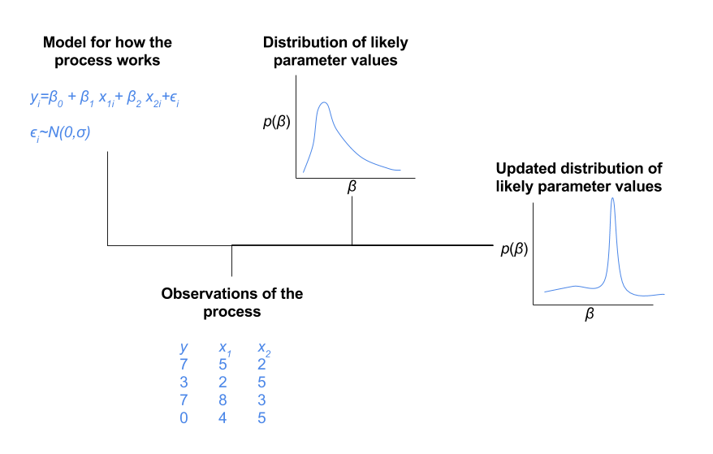

```{r setup, include=FALSE}
knitr::opts_chunk$set(echo = FALSE)
require(jpeg)
require(rstan)
## See this: http://stackoverflow.com/questions/15625990/how-to-set-size-for-local-image-using-knitr-for-markdown
```

## Module objectives
In this module, we will run a linear model (standard regression) using Stan.  
  
This will allow us to:  
- Understand how to do Bayesian inference with Stan without getting bogged down in modeling details.  

Running a linear model in Stan isn't something we would normally do in our own work, but it gives us a simple starting point that most people are familar with. We will add details and complexity in subsequent modules.

## Let's get started!
- Open the file `lm.R` from the folder `1_lm` folder.  
- In that file, you will find the code for this module and can run the code to follow along. 
- Nearly all the code in `lm.R` is contained in these slides, as well.  

# Computer conjoint analysis with a linear model

## Computer conjoint data
- Our first data set is a *ratings-based* conjoint study reported in Lenk, Desarbo, Green and Young (1996).  Thanks, Peter!
- In this study, respondents were shown computer profiles (combinations of features) and rated them on a 0-10 scale.  
- Our goal is to analyze this data using a linear model (i.e. standard regression) relating the respondents' ratings to the features of the computers.  
- By interpreting the coeficients, we will know how much people value the features of computers (or at least how they valued features back in the early 90's.)


## Read the data into R
```{r, echo = TRUE, eval=TRUE}
cc.df <- read.csv("ComputerConjointData.csv")
head(cc.df)
```

## Inspect the data in R
```{r, echo = TRUE}
summary(cc.df)
```

## Plot the data in R
```{r, echo = TRUE}
plot(LIKE ~ Price, data = cc.df, ylab = "Rating (0-10)") 
```

## Have data. Still need model.
```{r, fig.align="center"}

```

## Stan model specification
- In most statistical software (e.g., SPSS, JMP, Stata, SAS, base R, `MCMCpack`), you are provided with a menu of different models that you can run such as standard regression, logistic regression, poisson regression, etc.  
- In Stan, you specify the model you want to estimate using a special syntax. 
- This gives you the freedom to specify any model you want. 
- When we want to estimate a standard regression, we still need to specify the model, which helps us remember to think carefully about the model. 

## Stan model components
- `data` declares the structure of the data that you observe  
- `parameters` declares the parameters of your model   
- `model` describes the model you want to estimate  
    + And, optionally, your priors on the parameters of that model   
 
## Stan `data` 
The data structures and their dimensions must all be declared in the `data` block.   
*Don't type this into R!*  
```{stan, eval=FALSE, echo=TRUE, output.var="dummy"}
data {
  int N;  
  int K;
  vector[N] y;
  matrix[N,K] X;
}
```
For this model, the data is a matrix describing the attributes of the products that were shown to respondents (`X`) and the vector of ratings that the respondents gave those products (`y`).  
There are `N` evaluations and `K` product attributes. Note that dimensions are declared explicitly. 

## Stan `model`
The `model` block we specify says that the ratings `y` are normally distributed with mean `beta0 + X*beta` and standard deviation `sigma`.  
*Don't type this into R!*  
```{stan, eval=FALSE, echo=TRUE, output.var="dummy"}
model {
  y ~ normal(beta0 + X*beta, sigma);
}
```  
That's pretty straightforward!

## Stan `parameters`
- intercept `beta0`  
- a vector of `K` parameters that multiplies the product attributes in `X` which is called `beta`   
- a variance parameter `sigma`  
*Don't type this into R!*  
```{stan, eval=FALSE, echo=TRUE, output.var="dummy"}
parameters {
  real beta0;
  vector[K] beta;
  real<lower=0> sigma;
}
```  
The parameters we are really after are those in the `beta` vector, which are sometimes called the part-worths of the product attributes.  

## Stan specification as a text string in R
```{r, eval=TRUE, echo=TRUE}
lm.stan <- "
data {
  int N;  
  int K;
  vector[N] y;
  matrix[N,K] X;
}

parameters {
  real beta0;
  vector[K] beta;
  real<lower=0> sigma;
}

model {
  y ~ normal(beta0 + X*beta, sigma);
}
"
```

# Preparing the computer data for Stan

## Preparing data for Stan: `y`
When you pass data to Stan, it needs to be in the format that we have declared in our Stan code. To create the `y` variable in R: 
```{r, eval=TRUE, echo=TRUE}
y <- cc.df[!is.na(cc.df$LIKE),"LIKE"]
str(y)
```

## Preparing data for Stan: `X` (wrong!)
For `X`, we want to include all of the product features, which are: 
```{r, eval=TRUE, echo=TRUE}
X <- cc.df[!is.na(cc.df$LIKE), 4:16]
head(X)
```

## Preparing data for Stan: `X` (right!)  
However, in the original data, the values of the attributes are text labels like `8MB` while Stan is expecting a matrix of real numbers that it can use in multiplication.  We can code these attributes as numbers using the R function `model.matrix`.  
```{r, eval=TRUE, echo=TRUE}
X <- model.matrix(~ HotLine + RAM + Screen + CPU + HardDisk + 
                    CD + Cache + Color + Channel + Warranty + 
                    Software + Guarantee + Price, 
                  data=cc.df[!is.na(cc.df$LIKE),])
X <- X[,2:ncol(X)] ## remove intercept
head(X)
```

## Preparing data for Stan: bundling it up
Finally, to pass the data to Stan, it needs to be bundled up as a `list` object in R. 
```{r, eval=TRUE, echo=TRUE}
cc.standata <- list(N=length(y), K=ncol(X), y=y, X=X)
str(cc.standata)
```
## Tidy up the R workspace by removing `y` and `X` 
```{r, eval=TRUE, echo=TRUE}
rm(y, X)
```

## Bayesian statistical inference
```{r, fig.align="center"}

```

# Running the model

## Running the model
Now that we have a Stan model and data in Stan format, we can ask Stan to produce random draws from the posterior for us. 
```{r, eval=TRUE, echo=TRUE, cache=TRUE}
library(rstan)  ## load interface to Stan
m.stan <- stan(model_code = lm.stan, data = cc.standata, 
               iter = 1000, chains=1)
```
This part was easy for us, but it may take some time for the computer to produce the posterior draws.

## What's `stan()` doing? 
- `stan()` is producing a sample of draws from the posterior distribution.  
- When you call `stan()`, it first translates the model and data into a program for producing the posterior draws, then runs that program and feeds the output back to R.  
- While much Bayesian software uses an MCMC algorithm called Gibbs sampling to produce the posterior draws, Stan defaults to a different MCMC algorithm called Hamiltonian Monte Carlo. 
- One of the great things about Stan is you don't need to know too much about the algorithm to use the software (but knowing a little bit helps.)

## `stan()` output
The `stanfit` object that is returned to R from `stan()` stores everything about the run: the model text, the posterior draws, the names of the parameters, etc.
```{r, eval=TRUE, echo=TRUE}
str(m.stan)
```

## Getting the posterior draws
The core output of Stan is a matrix of posterior draws for all the parameters. We can get the posterior draws using the `extract()` function from the `rstan` package. 
```{r, eval=TRUE, echo=TRUE}
mydraws <- extract(m.stan, pars=c("beta"))
head(mydraws$beta)
```

# Summarizing the draws

## Summarizing the posterior draws
- We usually summarize the draws to get a sense of what the parameters might be.  
- Some Bayesian software like Sawtooth CBC-HB does this step more automatically for the user, but the this two stage process is typical and allows the analyst to summarize the draws as she likes.  

## Posterior summaries
```{r, eval=TRUE, echo=TRUE}
summary(m.stan)$summary
```

## Adding labels to the posterior summary
```{r, eval=TRUE, echo=TRUE}
cc.lab <- c("Intercept", dimnames(cc.standata$X)[[2]], "sigma", "lp__")
data.frame(label=cc.lab, summary(m.stan)$summary)
```

## Bayesian hypothesis testing
We can compute the probability that a parameter is greater than some threshold like zero just by summarizing the draws.  
```{r, eval=TRUE, echo=TRUE}
mean(mydraws$beta[,6]>0)
mean(mydraws$beta[,8]>0)
```
If more than 95% of draws are greater than 0, then it is very likley that the parameter is greater than zero. 

## Plotting the parameters
```{r, eval=TRUE, echo=TRUE, message=FALSE}
plot(m.stan, pars=c("beta0", "beta"))
```

## Interpretation
- Having a CD drive increases the rating by almost a point (`beta[6]`).  
- Including the faster processor increasing the rating by almost a point (`beta[4]`).   
- The higher price reduces the rating by more than 2 points (`beta[13]`).  
- The color has almost no effect on the rating (`beta[8]`).  

## Assessing convergence with traceplots
There is some risk that the Stan sampler did not reach the proper posterior.  If this happens, we can usually detect it by ploting the draws in order over time (called a *traceplot*.) 
```{r, eval=TRUE, echo=TRUE}
plot(m.stan, plotfun="trace", pars=c("beta0", "beta", "sigma"))
```

## Fuzzy caterpillar
Traceplots should look like fuzzy caterpillars.
```{r, fig.align="center"}

```

## Histograms of posterior draws
Histograms of the draws approximate posterior densities.
```{r, eval=TRUE, echo=TRUE}
plot(m.stan, plotfun="hist", pars=c("beta0", "beta", "sigma"))
```

## Density plots of posterior draws
Or you could use a density plot, if you prefer.
```{r, eval=TRUE, echo=TRUE}
plot(m.stan, plotfun="dens", pars=c("beta0", "beta", "sigma"))
```

## Combining plots
We happen to like this plot from another R package:
```{r, eval=FALSE, echo=TRUE}
library(bayesplot)
mcmc_combo(As.mcmc.list(m.stan))
```
But it doesn't work very well with 15 parameters.

## Other things you can get from the `stanfit` object
```{r, eval=TRUE, echo=TRUE}
get_stanmodel(m.stan)
```

# Summary of Module 1

## What have we accomplished?
- We've reviewed Bayesian inference. 
- We've fit linear model to the computer conjoint data using Stan.
    + More precisely, we have computed a posterior sample for the parameters of the linear model using the computer conjoint data.
- The model suggests that CD and CPU are the most important attributes with customers prefering computers that have a CD drive and have a faster CPU. 

## Stan modeling steps
1. Read data into into R and inspect
2. Create model specifiction using the Stan language
    - `data`
    - `parameters`
    - `model`
3. Munge data into Stan format (list of vectors and matricies)
4. Call `stan()` to create the posterior draws
5. Assess convergence
6. Summarize and visualize the draws to make inferences

## Advanced techniques
- In the file `lm_advanced.R` you will find code for several advanced topics   
    - Testing the model using synthetic data   
    - Comparing inference from `stan()` to `lm()`   
        + OLS regression in R using `lm()`  
        + Bayesian regression using `MCMCregress()` from `MCMCPack`  

## A note on hierarchical models
- Lenk et al. (1996) used this data set to illustrate a *hierarchical* linear model and that is a more approrpriate model for this data.  
- However, we are going to switch to choice models before we get to hierarchical models.  