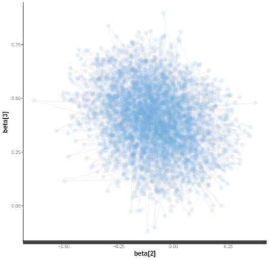

```{r setup, include=FALSE}
knitr::opts_chunk$set(echo = TRUE, eval=TRUE)
```

## Module objective
In this module, we will build and estimate a multinomial logit model using Stan.   
  
This will allow us to:  
- Start to learn the Stan model syntax.  
- Go through the Bayesian inference process more carefully and completely.  

# Stan model syntax basics

## Required Stan model components
```{r, eval=FALSE, echo=FALSE}
# outputvar="stanjunk" is a kludge to make RMarkdown ignore the 
# stan code.  This code reads directly from mnl.stan.
# See http://rmarkdown.rstudio.com/authoring_knitr_engines.html#stan 
# for alternative approach to stan in RMarkdown. 
```

```{stan, output.var="stanjunk", eval=FALSE}
data{
  // declarations of data go here
}
parameters{
  // declarations of parameters go here
}
model{
  // distributions for observables and 
  //parameters (priors) are specified here
}
```
There are a few other types of blocks in a Stan model; the [Stan Language User's Guide and Reference Manual](https://github.com/stan-dev/stan/releases/download/v2.15.0/stan-reference-2.15.0.pdf) is a complete and relatively friendly guide. 

## Stan types: scalars and arrays
Every variable in a Stan model must have a declared type. Common types are: 

**Scalars** (single variable)
```{stan, eval=FALSE, output.var="stanjunk",}
real myvar1;
int myvar2;
```
**Arrays**
```{stan, eval=FALSE, output.var="stanjunk",}
real myarray1[2, 3]; # 2 x 3 array of reals
int myarray2[5, 6, myvar1];  # dims may be other declared variables
```

## Stan types: vectors and matrices
Specific `vector` and `matrix` types must be used when you want to do matrix operations or use multivariate probability distributions.   

**Vectors and Matrices**
```{stan, eval=FALSE, output.var="stanjunk",}
vector[25] myvector;  // column vector of length 25
row_vector[10] myrowvector; // row vector of lenght 25
matrix[10, 25] mymatrix; 
```
- You can multiply a `vector` by a `matrix` or a `matrix` by a `matrix` (assuming dimenions match). 
- You can not use multiplication with an `array`.  
- Elements of a `vector` or `matrix` are always `real`.

## Stan types: array of vectors or matrices
You are also allowed to declare an array of vectors or an array of matricies.  
  
**Combining matrices or vectors with arrays**
```{stan, eval=FALSE, output.var="stanjunk",}
matrix[25, 3] myarrayofmatrices[1000];
```
- This produces an array of 1000 matrices that each have 25 rows and 3 columns.    

## Constraints
Any declaration can include a constraint, which applies to all elements in the variable.  
```{stan, eval=FALSE, output.var="stanjunk",}
real<lower=0> myarray2[10, 20];
```
- For data, the constraint provides some data checking.  
- For parameters, it constrains the posterior of the parameter.   
- Note the model must have support (non-zero density) at every value of the parameters
that meets their declared constraints. If the declared parameter constraints are less strict than the support, the samplers and optimizers may have any of a number of pathologies including just getting stuck, failure to initialize, etc. 

## Summary of basic Stan types
**Scalars**
```{stan, eval=FALSE, output.var="stanjunk"}
int<lower=c1, upper=c2> varname;
real<lower=c1, upper=c2> varname;
```
**Arrays**
```{stan, eval=FALSE, output.var="stanjunk"}
int<lower=c1, upper=c2> varname[dim1, dim2, ...];
real<lower=c1, upper=c2> varname[dim1, dim2, ...];
```
**Vectors and Matrices**
```{stan, eval=FALSE, output.var="stanjunk"}
vector<lower=c1, upper=c2>[length] varname[dim1, dim2, ...];
row_vector<lower=c1, upper=c2>[length] varname[dim1, dim2, ...];
matrix<lower=c1, upper=c2>[rows, cols] varname[dim1, dim2, ...]; 
```

## Stan data types: others
- While these are the main data types we use regularly, there are many other data types that Stan provides.  
- We'll leave it to you to discover those in the context of specific examples where they are useful. 

## Specifing probability distributions
The core of any Stan model is the `model` block, where you define probability distributions for the observables. For instance, in our linear model, we defined y as normally distributed. 
```{stan, eval=FALSE, output.var="stanjunk"}
y ~ normal(beta0 + X*beta, sigma);
```
This sort of declaration of the distribution of an observable is called a **sampling statement**. 

## Stan probability distributions
Stan provides many, many distributions so that you can flexibly define the model. 
```{stan, eval=FALSE, output.var="stanjunk"}
y ~ normal(mu, sigma);
y ~ student_t(nu, mu, sigma);
y ~ cauchy(mu, sigma);
```
```{stan, eval=FALSE, output.var="stanjunk"}
y ~ lognormal(mu, sigma);  
y ~ exponential(beta);
```
```{stan, eval=FALSE, output.var="stanjunk"}
theta ~ beta(alpha, beta);
```
```{stan, eval=FALSE, output.var="stanjunk"}
n ~ poisson(lambda);
```
```{stan, eval=FALSE, output.var="stanjunk"}
y ~ categorical_logit(beta);
```

## Referring to data and parameters
To pull out an element of an array or matrix you can use `[ ]`:
```{stan, eval=FALSE, output.var="stanjunk",}
matrix[25, 3] myarrayofmatrices[1000];  # declared in data
...
myarrayofmatrices[1]; // first matrix in array of 1000
myarrayofmatrices[1, 2, 3]; // element in second row and third column 
                            // in the first matrix in array of 1000
```
- When indexing the array of matrices, array dimensions come first, then the row and column.  
    + myarrayofmatrices[1] is the first matrix in the array
    + myarrayofmatrices[1,2,3] is the element in the second row and third column
    
## Priors
- If you don't specify a distribution for a parameter, Stan will assume a *uniform* prior on that parameter. 
    + We used uniform priors in our linear model.
- You specify a prior for a parameter by defining a distribution for the parameter in the `model` block.
- Since the NUTS algorithm used by default in Stan is gradient-based, there is no benefit to sticking to conjugate priors (as in Gibbs sampling). 

## Learning more about Stan syntax 
The best way to learn about the Stan language is to read the [Stan Modeling Language: 
User’s Guide and Reference Manual](file:///C:/Users/emf75/Downloads/stan-reference-2.15.0%20(2).pdf), which is fairly easy to read and introduces much of the syntex in the context of specific examples. 

# Stan code for mnl

## Stan model files
- As projects get more complicated, it is a good idea to keep the Stan code in separate file with the .stan extension. 
- One advantage is that R Studio will color code the syntax in a .stan file. 
- Our Stan model is in `mnl.stan`.  You can check it out by opening it in RStudio or any text editor.

## Data
```{stan, eval=FALSE, output.var="stanjunk"}
data {
	int<lower=2> C; // # of alternatives (choices) in each scenario
	int<lower=1> N;	// # of observations
	int<lower=1> K; // # of covariates
	int<lower=1,upper=C> Y[N]; // # observed choices
	matrix[C,K] X[N]; // # matrix of attributes for each obs
}
```

## Parameters
```{stan, eval=FALSE, output.var="stanjunk"}
parameters {
	vector[K] beta;
}
```

## Model
```{stan, eval=FALSE, output.var="stanjunk"}
model {
  # priors
	// beta ~ normal(0,3); // often used in mcmc
	beta ~ cauchy(0, 2.5);  // better
	# model
	for (i in 1:N)
		Y[i] ~ categorical_logit(X[i]*beta);
}
```
Note that the scale of the prior on `beta` assumes that the predictors are standardized.  See [Gelman (2008)](http://www.stat.columbia.edu/~gelman/research/published/standardizing7.pdf) and [Gelman(2009)](http://www.stat.columbia.edu/~gelman/research/published/priors11.pdf) for more details. 

# Testing with synthetic data

## Bayesian statistical inference 
```{r, fig.align="center", echo=FALSE}
knitr::include_graphics("images/Bayesian_Inference.png")
```

## Testing with synthetic data
- When you are building any statistical estimation routine, it is a good idea to test it out with data that you generated synthetically.  
- By running the model with data where you know the parameters, you can compare to confirm that the estimation routine is is working properly.  
    + In Bayesian inference, we are looking for a posterior that "covers" the true parameter values.
- This also allows you to build the analysis before you've got the data. 
    + We've never been stuck waiting for data, but maybe you have ;)

## Libraries and options
Now it is time to start working in R. Open up `mnl.R` and begin by loading a few libraries and setting a few options. 
```{r, message=FALSE, warning=FALSE}
library(rstan)
library(shinystan)

# writes a compiled Stan program to the disk to avoid recompiling
rstan_options(auto_write=TRUE) 
# allows Stan chains to run in parallel on multiprocessor machines
options(mc.cores = parallel::detectCores())
```

## Generating synthetic data
R function for generating choice data from the multinomial logit model:
```{r}
generate_mnl_data <- function(N=1000, C=3, beta=c(1, -2)){
  K <- length(beta)
  Y <- rep(NA, N)
  X <- list(NULL) 
  for (i in 1:N) {
    X[[i]] <- matrix(rnorm(C*K), ncol=K) # normal covariates  
    Y[i] <- sample(x=C, size=1, prob=exp(X[[i]]%*%beta)) # logit
  }
  list(N=N, C=C, K=K, Y=Y, X=X)
}
```
Our function returns data as a list of objects of the same names and dimensions as the declared data in `mnl.stan`. This is the format that `stan()` requires. 

## Synthetic data
Use the function to generate synthetic data.  Remember the true value of `beta` is 1, -2. 
```{r}
d1 <- generate_mnl_data(N=1000, C=3, beta=c(1, -2))
str(d1)

```

## Run Stan model on synthetic data
To run the model, we call the `stan()` function. Note that we pass filename `mnl.stan` to the stan function.  Make sure that file is in the working directory (or provide a full path)!
```{r}
test.stan <- stan(file="mnl.stan", data=d1, iter=1000, chains=4) 
summary(test.stan)$summary
```

## Running multiple chains
When we called Stan, we asked it to run the NUTS algorithm four times (independantly). This is a good practice as it allows you to assess the convergence of the algorithm! We can can access the summary for indivdual chains with the command: 
```{r}
summary(test.stan)$c_summary
```

## Rhat and n_eff
- The summary reports two statistics that allow us to evaluate whether the algorithm is working properly.  
    - **Rhat** compares the variation within chains to the variation between chains and should be close to 1 (also called the potential scale reduction factor)  
    - **n_eff** is a crude approximation of the effective number of independent draws from the posterior
```{r}
summary(test.stan)$summary
```

## Rules of thumb for Rhat and n_eff
- **Rhat** should be less than 1.1 for all parameters (and not too much less than 1)
- **n_eff** should be greater than 400 for all parameters (although we sometimes go with n_eff around 100, for long-running models)  

If these conditions are not met, then  
1. Inspect the traceplots to see what is happening  
2. Run the model longer    
3. (Pro tip) Consider re-parameterizing to improve computation

## Traceplots look fine
```{r}
plot(test.stan, plotfun="trace")
```

## Plot of the parameter estimates 
```{r,  message=FALSE, warning=FALSE}
plot(test.stan)
```

## Histograms of the posteriors
```{r,  message=FALSE, warning=FALSE}
plot(test.stan, plotfun="hist")
```

## Density plots of the posteriors
```{r, message=FALSE, warning=FALSE}
plot(test.stan, plotfun="dens") 
```

## Model confirmed
1. Convergence is good.  
2. Estimated posteriors of `beta` include support for the true values.  

This synthetic data test confirmes that Stan seems to be working well with this model. Now we can apply it to some real data.  

# Choice-Based Conjoint Data for Chocolate Bars

## Choice-based conjoint data for chocolate bars
- Fourteen respondents each answered 25 choice tasks where they selected from among three chocolate bars. 
- Three attributes
    + Brand: Hersheys, Dove, Lindt, Godiva, Ghirardelli
    + Type: Milk, Milk with nuts, Dark, Dark with nuts, White
- Data was generously shared by Betty Kim-Viechnicki and Joe Cable. 
    + Originally described in Kim-Viechnicki, B.E., Burla, Y., Feit, E., Plassmann, H., & Kable, J.W. (2013). Decisions about chocolate are processed differently than decisions on gambles: Evidence from eye-tracking.
 
## Read in the chocolate data
```{r}
choc.df <- read.csv("cbc_chocolate.csv")
choc.df
```
## Summary of chocolate data
```{r}
summary(choc.df)
```

## Data inspection: **Brand** v. choice
```{r}
mosaicplot(~ Brand + Chosen, data=choc.df)
```

## Data inspection: **Type** v. choice
```{r}
mosaicplot(~ Type + Chosen, data=choc.df)
```

## Data inspection: **Price** v. choice
```{r}
mosaicplot(~ Price + Chosen, data=choc.df)
```

# Preparing the Chocolate CBC data for Stan

## Coding discrete variables
As with the computer ratings-based conjoint data in Module 1, we have two discrete attributes that need to be coded: `Brand` and `Type`.  
```{r}
choc.df
```

## Dummy coding 
As in, "Just don't do it, dummy."  Unfortunately, the default coding in `model.matrix()` is dummy coding. This coding is useful in experiments where there is a control condition, but is less useful for discrete attributes in conjoint where no level is "special".
```{r}
model.matrix(~ Brand, data = choc.df)
```

## Effects coding (1)
- A better coding scheme is the sum-to-one coding.  
    - No level is designated as the base level.  
    - All parameter values can be interpreted as "relative to the average."   
    - You can compute a parameter value for the left-out level (negative sum of the parameters for other levels).  
    - It is easier to put a symetric prior on these parameters. See [Kevin's blog post](http://bayesium.com/a-symmetric-effects-prior/). 

## Effects coding (2)
```{r}
model.matrix(~ Brand, data = choc.df, 
             contrasts = list(Brand = "contr.sum"))
```

## Coding the chocolate data
```{r}
choc.contrasts <- list(Brand = "contr.sum", Type = "contr.sum")
choc.coded <- model.matrix(~ Brand + Type, data = choc.df, 
                           contrasts = choc.contrasts)
choc.coded <- choc.coded[,2:ncol(choc.coded)] # remove intercept
# Fix the bad labels from contr.sum
choc.names <- c("BrandDove", "BrandGhirardelli", "BrandGodiva", 
                "BrandHersheys", "TypeDark", "TypeDarkNuts", 
                "TypeMilk", "TypeMilkNuts")
colnames(choc.coded) <- choc.names 
```

## Append the coded attributes to `choc.df`
```{r}
choc.df <- cbind(choc.df, choc.coded)
head(choc.df)
```

## Respondents and questions
```{r}
unique(choc.df$Ind)
unique(choc.df$Trial)
```

## Creating objects like those declared in `mnl.stan`
```{r}
R <- length(unique(choc.df$Ind))
S <- length(unique(choc.df$Trial))
Y <- rep(NA, R*S)
X <- vector("list", R*S)
n <- 1
for (r in unique(choc.df$Ind)) { # respondents
  for (s in unique(choc.df$Trial)){ # choice scenarios
     scenario <- choc.df[choc.df$Ind==r & choc.df$Trial==s,]
     X[[n]] <- data.matrix(scenario[,c(7, 9:16)]) # price and coded brand and type
     Y[n] <- scenario$Alt[as.logical(scenario$Chosen)]
     n <- n + 1
  }
}
```

## Double check `X` and `Y`
```{r}
str(Y)
str(X)
```

## Create the list object for `stan()`
```{r}
choc.standata <- list(N=length(Y), C=3, K=9, Y=Y, X=X)
rm(Y, X, n, R, S, r, s, choc.contrasts, scenario, choc.coded)
```

# Estimating the mnl model using the chocolate data

## Call Stan
```{r}
choc.stan <- stan(file="mnl.stan", data=choc.standata) 
# default: chains=4, iter=2000
```

## Check for convergence (1)
Inspect `Rhat` and `n_eff` in the summary output.
```{r}
summary(choc.stan)$summary[,c("n_eff", "Rhat")]
```

## Check for convergence (2)
Eyeball the traceplots.
```{r}
plot(choc.stan, plotfun="trace")
```

## Visualize parameter posteriors
```{r, echo=TRUE, message=FALSE}
plot(choc.stan)
```

## Summarize the estimates
```{r}
data.frame(params=c("Price", choc.names), check.names=FALSE, 
           summary(choc.stan, pars=c("beta"))$summary)

```

## More posterior summaries with ShinyStan
```{r, eval=FALSE}
launch_shinystan(choc.stan)
```

## The posterior is multidimensional
Don't forget that the posterior is multidimensional.  If you find a strong posterior correlation between two parameters, it means those two parameters are partially confounded in the data. 
```{r, fig.align="center", echo=FALSE}

```

# Simulating choice shares in R using posterior draws

## Function for computing shares from a point estimate of beta
```{r}
shares.mnl.point <- function(beta,  # vector of parameters (part-worths)
                             X) {   # attribute matrix X for scenario (coded)
  if (length(beta) != ncol(X)) 
    stop("length of beta doesn't match columns in X")
  V <- exp(X %*% beta)
  data.frame(shares=V/sum(V), X)
}
```

## Computing shares from point estimates (1)
Pull out the posterior means of beta. 
```{r}
beta.mean <- summary(choc.stan)$summary[1:9,1]
beta.mean
```

## Computing shares from point estimates (2)
Compute shares. 
```{r}
shares.mnl.point(beta.mean, choc.standata$X[[1]]) 
```
**This is bad practice as it does not account for our uncertainty in beta!**

## Posterior draws of `beta`
To understand the full posterior of the shares, we should use all of the posterior draws for beta, which represent out uncertainty in `beta`.
```{r}
beta.draws <- extract(choc.stan, pars="beta")$beta
head(beta.draws)
```

## Function for computing shares for each of the posterior draws of `beta`
Once you have a set of posterior draws for the model parameters, you can obtain posterior draws for any function of those parameters by computing the function for each draw. 
```{r}
shares.mnl.post <- function(draws,  # matrix of draws (use extract())
                            X) {    # attribute matrix X for scenario
  shares <- matrix(NA, nrow=nrow(draws), ncol=nrow(X))
  for (draw in 1:nrow(draws)) {
     shares[draw,] <- shares.mnl.point(draws[draw,], X)[,1]
  }
  shares
}
```

## Posterior distribution of shares (1)
```{r}
shares.draw <- shares.mnl.post(beta.draws, choc.standata$X[[1]])
summary(shares.draw)
```

## Posterior distribution of shares (2)
```{r}
apply(shares.draw, 2, quantile, probs=c(0.5, 0.025, 0.975))
```

# Summary of Module 2

## In this module we have  
- Built a multinomial logit model in Stan.  
    + `data`, `parameters` and `model` blocks  
    + core data types: arrays, vectors, matrices  
    + sampling statements and distributions  
- Tested the model using synthetic data.  
- Estimated the model using chocolate bar CBC data.  
- Computed the full posterior of shares based on the posterior draws of `beta`.   
- Learned about the `Rhat` and `n_eff` measures for assessing convergence.

Next, we move on to hierarchical models. 