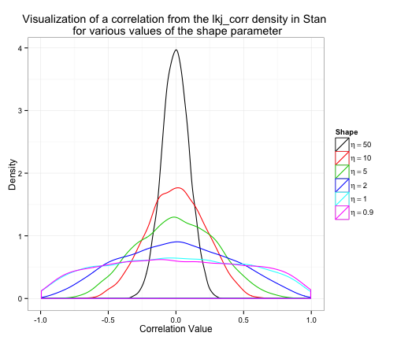

```{r setup, include=FALSE}
knitr::opts_chunk$set(echo = TRUE, eval=TRUE)
```

## Module objective
In this module, we will fit a hierarchical multinomial logit model using choice based conjoint data for chocolate bars.  

This will allow us to:  
- Learn more Stan syntax  
- Work with a hierarchical model  
- Fit a model that is commonly fit in marketing and usually requres specialized software  

Many will be familar with estimating this model using Sawtooth CBC/HB or the ChoiceModelR package in R.  

# More Stan syntax

## Hierarchical models
There is substantial evidence that different people have different preferences over the features of products.  To accomodate this, we alter the multnomial logit model by allowing each person to have her own vector of part-worths for the attributes. 
```{stan, eval=FALSE, echo=TRUE, output.var="dummy"}
Y[r,s] ~ categorical_logit(X[r,s]*Beta[,r]);
```
Becuase there is typically insufficient data to estimate each person's `beta[,r]` vector, we then impose a distribution on the individual-level betas.  
```{stan, eval=FALSE, echo=TRUE, output.var="dummy"}
Beta[,r] ~ multi_normal(Theta*Z[,r], Sigma);
```

## Multivariate normal distribution 
This is the first time we have seen a *multivariate* distribution in Stan. This is the *multivariate normal distribution.*
```{stan, eval=FALSE, echo=TRUE, output.var="dummy"}
y ~ multi_normal(mu, Sigma);	
```
`y` is a vector (or an array of vectors for multiple observations)  
`mu` is the mean vector  
`Sigma` is the covariance matrix.  

If this distribution is new to you, check out the [wikipedia page](https://en.wikipedia.org/wiki/Multivariate_normal_distribution). 

## Covariance matricies
Covariance matrices like `Sigma` are square matrices with special properties. Stan provides special data types just for storing covariance matrices: 
```{stan, stan, eval=FALSE, echo=TRUE, output.var="dummy"}
corr_matrix[K] mycorrmatrix; 
```
And there is a covariance matrix type as well: 
```{stan, eval=FALSE, echo=TRUE, output.var="dummy"}
cov_matrix[K] mycovmatrix;
```

## Other parameterizations
If you prefer other parameterizations of the multivariate normal, they are available. 
```{stan, eval=FALSE, echo=TRUE, output.var="dummy"}
y ~ multi_normal_prec(mu, Omega);
y ~ multi_normal_cholesky(mu, L);
```
There are even special types for Cholesy factors, if you are into that. (It can be important for computational efficiency.)
```{stan, eval=FALSE, echo=TRUE, output.var="dummy"}
cholesky_factor_cov[K] L;
cholesky_factor_cor[K] L;
```

## Other multivariate distributions
Gaussian process
```{stan, eval=FALSE, echo=TRUE, output.var="dummy"}
y ~ multi_gp(Sigma, w);
```
Multivariate Student t
```{stan, eval=FALSE, echo=TRUE, output.var="dummy"}
y ~ multi_student_t(nu, mu, Sigma);
```
Gaussian DLM
```{stan, eval=FALSE, echo=TRUE, output.var="dummy"}
y ~ gaussian_dlm_obs(F, G, V, W, m0, C0);
```
See the the [Stan Modeling Language Users Guide and Reference Manual](http://mc-stan.org/users/documentation/) for more! 

## Priors for covariances 
One of the difficult things about using the multivariate normal distribution is putting a prior on the covariance `Sigma.` Gibbs samplers often use the *inverted Wishart* prior, which is conjugate. And Stan supports that:
```{stan, eval=FALSE, echo=TRUE, output.var="dummy"}
W ~ inv_wishart(nu, Sigma);
``` 
However, this prior often puts undue weight near `Sigma` and can influence the posterior in strange ways.  

## LKJ Prior for correlations
Many analysts have an intuitive sense for correlations; they are always between -1 and 1 with zero indicating no association. The LKJ distribution puts a prior on the correlation matrix. 
```{stan, eval=FALSE, echo=TRUE, output.var="dummy"}
Omega ~ lkj_corr(eta);
```
If `eta = 1` then the density is uniform over all correlation matrices of a given order  
If `eta > 1` the identity matrix is the modal correlation matrix, with sharper peaks in the density around the identity matrix for larger  `eta`.  This allows us to reduce correlations, if we have prior beliefs that there are not many correlations between part-worths.

## Visualizing the LKJ prior


This image was borrowed from the [Psychstatistics blog](http://www.psychstatistics.com/2014/12/27/d-lkj-priors/), which illustrates how to use Stan to simulate from the LKJ prior to produce this visualization. 

## Using LKJ to put a prior on covariance
We can put a prior on a covarince by specifing a variance vector `tau` along with a correlation matrix `Omega` (with the LKJ prior) and then use the `quad_form_diag` function to compute a covariance. 
```{stan, eval=FALSE, echo=TRUE, output.var="dummy"}
parameters{
  corr_matrix[K] Omega;
  vector<lower=0>[K] tau;
}
model{
  Omega ~ lkj_corr(2);
  Beta[,r] ~ multi_normal(mu, quad_form_diag(Omega, tau));
}
```

## Truncated distributions
You can truncate any distribution using this syntax: 
```{stan, eval=FALSE, echo=TRUE, output.var="dummy"}
mu ~ normal(mu, sigma) T[lower, upper];
```

## Assignment
Occasionally, you may need to assign one variable (data or parameter) to another, e.g. when you are tranforming data internally in Stan. To do that we use `=`.  

The symbol `~` is for sampling statements that define random variables.  

We will use truncation and assignment in just a few more slides.  

# Hierarchical multnomial logit model in Stan
Enough syntax!  Let's get on to the model. You can open the full model specification in `hmnl.stan`.

## Data
Putting all of that new syntax together, we can specify a hierarchical multinomial logit model. 
```{stan, eval=FALSE, echo=TRUE, output.var="dummy"}
data {
  int<lower=2> C; // # of alternatives (choices) in each scenario
  int<lower=1> K; // # of covariates of alternatives
  int<lower=1> R; // # of respondents
  int<lower=1> S; // # of scenarios per respondent
  int<lower=0> G; // # of respondent covariates 
  int<lower=1,upper=C> Y[R, S]; // observed choices
  matrix[C, K] X[R, S]; // matrix of attributes for each obs
  matrix[G, R] Z; // vector of covariates for each respondent
}
```

## Parameters
```{stan, eval=FALSE, echo=TRUE, output.var="dummy"}

parameters {
  matrix[K, R] Beta;
  matrix[K, G] Theta;
  corr_matrix[K] Omega;
  vector<lower=0>[K] tau;
}
```

## Transformed parameters
While it can be nice to look at the output in terms of the variance vector `tau` and the correlation matrix `Omega`, some still like covariances.  We can compute the covariance using the `transformed parameters` block in Stan. 
```{stan, eval=FALSE, echo=TRUE, output.var="dummy"}
transformed parameters {
  cov_matrix[K] Sigma = quad_form_diag(Omega, tau);
}
```

## Model
We can use any transformed parameters in our model block. 
```{stan, eval=FALSE, echo=TRUE, output.var="dummy"}
model {
  //priors
  to_vector(Theta) ~ normal(0, 10);
  tau ~ cauchy(0, 2.5); 
  Omega ~ lkj_corr(2);
  //likelihood
  for (r in 1:R) {
    Beta[,r] ~ multi_normal(Theta*Z[,r], Sigma);	
    for (s in 1:S)
      Y[r,s] ~ categorical_logit(X[r,s]*Beta[,r]);
  }
}
```

## Bayesian inference
```{r, fig.align="center", echo=FALSE}
knitr::include_graphics("images/Bayesian_Inference.png")
```

## Get setup in R
It's time to open the `hmnl.R` file and start running R code. 
```{r, message=FALSE, error=FALSE, warning=FALSE}
library(rstan)
library(MASS)
library(shinystan)
# writes a compiled Stan program to the disk to avoid recompiling
rstan_options(auto_write=TRUE) 
# allows Stan chains to run in parallel on multiprocessor machines
options(mc.cores = parallel::detectCores())
```

# Testing the hierarchical multinomial logit model with synthetic data
It's a good idea to test any new model with synthetic data.

## Synthetic data generation function (1)
```{r}
# function to generate mnl data
generate_hmnl_data <- function(R=100, S=30, C=3, 
                               Theta=matrix(rep(1, 8), nrow=2), 
                               Sigma=diag(0.1, 4)){
  K <- ncol(Theta)
  G <- nrow(Theta)
  Y <- array(dim=c(R, S))
  X <- array(rnorm(R*S*C*K), dim=c(R, S, C, K)) # normal covariates
  Z <- array(dim=c(G, R))
  Z[1,] <- 1  # intercept
  if (G > 1) {
    Z[2:G,] <- rnorm(R*(G-1)) # normal covariates
  }
  Beta <- array(dim=c(K, R))
  for (r in 1:R) {
    Beta[,r] <- mvrnorm(n=1, mu=Z[,r]%*%Theta, Sigma=Sigma)
    for (s in 1:S)
      Y[r,s] <- sample(x=C, size=1, prob=exp(X[r,s,,]%*%Beta[,r]))
   }
  list(R=R, S=S, C=C, K=K, G=G, Y=Y, X=X, Z=Z, 
       beta.true=beta, Theta.true=Theta, Sigma.true=Sigma)
}
```

## Synthetic data generation function (2)
```{r, eval=FALSE}
 for (r in 1:R) {
    Beta[,r] <- mvrnorm(n=1, mu=Z[,r]%*%Theta, Sigma=Sigma)
    for (s in 1:S)
      Y[r,s] <- sample(x=C, size=1, prob=exp(X[r,s,,]%*%Beta[,r]))
   }
  list(R=R, S=S, C=C, K=K, G=G, Y=Y, X=X, Z=Z, 
       beta.true=beta, Theta.true=Theta, Sigma.true=Sigma)
}
```

## Synthetic data
```{r}
d1 <- generate_hmnl_data()
str(d1)
```

## Running the hmnl on synthetic data
```{r, message=FALSE, warning=FALSE, error=FALSE}
test.stan <- stan(file="hmnl.stan", data=d1, iter=1000, chains=4) 
```

## Traceplots: Theta 
```{r}
plot(test.stan, plotfun="trace", pars=("Theta"))
```

## Traceplots: tau 
```{r}
plot(test.stan, plotfun="trace", pars=c("tau"))
```

## Traceplots: Omega 
```{r}
plot(test.stan, plotfun="trace", pars=("Omega"))
```

## Summary: Theta (Population means of part-worths)
```{r}
summary(test.stan, pars=c("Theta"))$summary
```

## Summary: tau (Population variances of part-worths)
```{r}
summary(test.stan, pars=c("tau"))$summary
```

## Summary: Omega (Populaltion correlations of part-worths)
```{r}
summary(test.stan, pars=c("Omega"))$summary
```

## Visualize parameters (1)
```{r, message=FALSE}
plot(test.stan, pars=c("Theta", "tau", "Omega"))
```

## Visualize parameters (2)
```{r, message=FALSE}
plot(test.stan, pars=c("Theta", "Sigma"))
```

# Prepare the chocolate cbc data

## Choice-based conjoint data for chocolate bars
- Fourteen respondents each answered 25 choice tasks where they selected from among three chocolate bars. 
- Three attributes
    + Brand: Hersheys, Dove, Lindt, Godiva, Ghirardelli
    + Type: Milk, Milk with nuts, Dark, Dark with nuts, White

## Tidy up and read in the chocolate data
```{r}
rm(list=ls()) # tidy up
choc.df <- read.csv("cbc_chocolate.csv")
```

## Coding the chocolate data
We've done this twice now, so we ought to package it up as a function (but we haven't). 
```{r}
choc.contrasts <- list(Brand = "contr.sum", Type = "contr.sum")
choc.coded <- model.matrix(~ Brand + Type, data = choc.df, 
                           contrasts = choc.contrasts)
choc.coded <- choc.coded[,2:ncol(choc.coded)] # remove intercept
# Fix the bad labels from contr.sum
choc.names <- c("BrandDove", "BrandGhirardelli", "BrandGodiva", 
                "BrandHersheys", "TypeDark", "TypeDarkNuts", 
                "TypeMilk", "TypeMilkNuts")
colnames(choc.coded) <- choc.names
choc.df <- cbind(choc.df, choc.coded)
```

## Coded chocolate data
```{r}
head(choc.df)
```

## Munge the data into Stan list format
```{r}
R <- length(unique(choc.df$Ind))
S <- length(unique(choc.df$Trial))
C <- max(choc.df$Alt)
K <- 9
Y <- array(dim=c(R, S))
X <- array(rnorm(R*S*C*K), dim=c(R, S, C, K)) 
Z <- array(1, dim=c(1, R)) # intercept only
for (r in 1:R) { # respondents
  for (s in 1:S){ # choice scenarios
    scenario <- choc.df[choc.df$Ind==unique(choc.df$Ind)[r] & 
                        choc.df$Trial==unique(choc.df$Trial)[s], ]
    X[r,s,,] <- data.matrix(scenario[,c(7, 9:16)]) 
    Y[r,s] <- scenario$Alt[as.logical(scenario$Chosen)]
  }
}
choc.standata <- list(C=C, K=K, R=R, S=S, G=1, Y=Y, X=X, Z=Z)
```

## Check the chocolate data
```{R}
str(choc.standata)
```

## Tidy up
```{r}
rm(Y, X, Z, R, S, r, s, C, K, choc.contrasts, scenario, choc.coded)
```

# Run the hmnl model with the chocolate data

## Bayesian inference
```{r, fig.align="center", echo=FALSE}
knitr::include_graphics("images/Bayesian_Inference.png")
```

## Call the `stan()` function
```{R}
choc.stan <- stan(file="hmnl.stan", data=choc.standata)
```

## Assess convergence with tracelots (1)
```{r}
plot(choc.stan, plotfun="trace", pars=("Theta"))
```

## Assess convergence with tracelots (1)
```{r}
plot(choc.stan, plotfun="trace", pars=c("tau"))
```

## Assess convergence with tracelots (1)
```{r}
plot(choc.stan, plotfun="trace", pars=c("Omega[1,2]"))
```

## Assess convergence with tracelots (1)
```{r}
plot(choc.stan, plotfun="trace", pars=paste("Beta[", 1:9, ",1]", sep="")) # resp 1
```

## Assess convergence with `Rhat` and `n_eff`
```{r}
summary(choc.stan)$summary[,c("Rhat", "n_eff")]
```

## Function for convergence checking
In a hierarchical model with many parameters, manually checking for convergence is pretty tedious.  So, we can write a function to automate that for us. 
```{r}
check_fit <- function(fit) {
  summ <- summary(fit)$summary
  range_rhat <- range(summ[ , 'Rhat'])
  rhat_ok <- 0.99 <= range_rhat[1] && range_rhat[2] <= 1.1
  range_neff <- range(summ[ , 'n_eff'])
  neff_ok <- range_neff[1] >= 400
  sp <- rstan::get_sampler_params(fit, inc_warmup=FALSE)
  max_divergent <- max(sapply(sp, function(p){ sum(p[ , 'divergent__']) }))
  no_divergent <- max_divergent == 0
  
  list(ok = rhat_ok && neff_ok && no_divergent,
       range_rhat = range_rhat,
       range_neff = range_neff,
       max_divergent = max_divergent)
}
```

## Checking convergence
Our model isn't converging well :(   
This is likely due to data limitations; we have just 14 respondents and 9 attributes. 
```{r}
check_fit(choc.stan)
```

## Options for addressing convergence problems 
- Consider whether there are any pathologies in the model specification
    + unlikely in this case
- Run the algorithm for longer
- Get more data
- Tighten up the priors

We are going to move on to use these posterior draws although we should probably not. 

# Summarizing the posterior distribution of the parameters

## Attributes
Remember, the attributes are: 
```{r}
c("Price", choc.names)
```

## Visualize the parameter estimates (1)
```{r, message=FALSE}
plot(choc.stan, pars=c("Theta", "tau"))
```

It is a shame that you can't give descriptive names to the attributes in Stan. 

## Visualize the parameter estimates (2)
```{r, message=FALSE}
plot(choc.stan, pars=c("Omega"))
```

## Visualize the parameter estimates (3)
```{r, message=FALSE}
plot(choc.stan, pars=paste("Beta[", 1:9, ",1]", sep="")) + 
  ggtitle("Respondent 1: Likes Milk Chocolate")
```

## Visualize the parameter estimates (4)
```{r, message=FALSE}
plot(choc.stan, pars=paste("Beta[", 1:9, ",2]", sep="")) + 
  ggtitle("Respondent 2: Likes Dark Chocolate")
```

## More posterior checking in ShinyStan
```{r, eval=FALSE}
launch_shinystan(choc.stan)
```

# Simulating shares

## Simulating shares from the hmnl
One way to simulate shares from a hierarchical model is to use the draws of the respondent-level parameters (`beta`). 
```{r}
shares.hmnl.post <- function(beta.draws, X) # X is attribute matrix
{
  R <- dim(beta.draws)[3]  # respondents
  D <- dim(beta.draws)[1]  # draws
  shares <- array(NA, dim=c(nrow(X), R, D))
  for (d in 1:D) {
    for (r in 1:R) {
      beta <- beta.draws[d,,r] 
      V <- exp(X %*% beta)  
      shares[,r,d] <- V/sum(V)
    }
  }
  shares
}
```


## New choice set
```{r}
choc.standata$X[1,1,,] 
rbind(c("Price", choc.names), choc.standata$X[1,1,,])
```

## Simulated shares for each respondent
```{r}
shares <- shares.hmnl.post(extract(choc.stan, pars=c("Beta"))$Beta, 
                          choc.standata$X[1,1,,])
str(shares)
```

## Summary of simulated shares
Our uncertainty (with only 14 respondents) is reflected in our share predictions
```{r}
apply(shares, 1, quantile, probs=c(0.5, 0.025, 0.975))
```

## Share predictions for indivdiuals
```{r}
apply(shares, 1:2, quantile, probs=c(0.5, 0.025, 0.975))
```

# Summary of Module 3

## In this module we have: 
- Built a hierarchical multnomial model in Stan. 
    + multivariate normal distribution
    + correlation and covariance matrices
    + LKJ prior
    + transformed parameters
- Tested it with synthetic data
- Estimated it using the chocolate cbc data
- Learned how to automate the process of checking convergence
- Simulated shares from a hierarchical model


## Next in Module 4
The next module will illustrate the real power of Stan, which is to flexibly create new models. 

