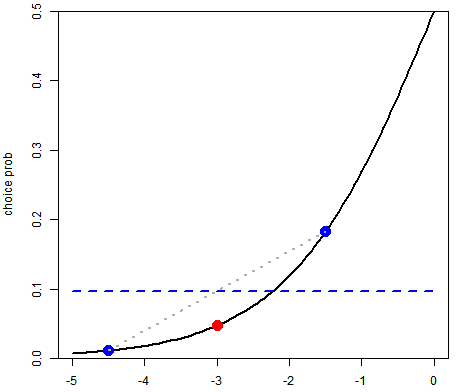
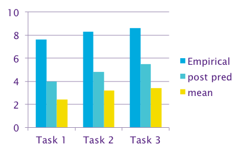
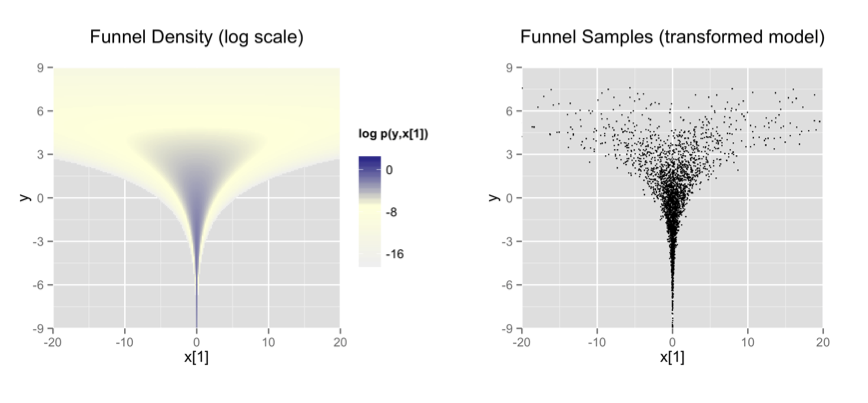

```{r setup, include=FALSE}
knitr::opts_chunk$set(echo = FALSE)
require(gridExtra)
require(grid)
require(jpeg)
require(png)
require(rstan)
```

## Module Objectives

In this module we illustrate how Stan can be used to fit a non-standard model.  This flexibility to fit almost any model you can imagine is a key advantage of Stan.

## Acknowledgments

```{r, out.width="30%", fig.align="center" }

```

Based on work done for the Modellers along with Michael Smith. Stan code © 2015, The Modellers, licensed under GPL v2.

```{r, fig.align="center"}
knitr::include_graphics("img/Adobe_standard_logo_RGB.eps")
```

Thanks to Kevin's employer Adobe Systems for their support.

## The Problem: Failed Validation Tasks

Choice-based conjoint survey; dual-response DCM.

Validation tasks: one product shown, asked if they would buy.

\ 

## Posterior Predictive Probabilities

Weighted average of choice probabilities.

Weight by posterior probability of parameter vector $\psi$.
$$ \Pr(c\mid s,i,D) = \int \Pr(c\mid s, i, \psi) p(\psi \mid D) \,\mathrm{d}\psi $$

Choice $c$, scenario $s$, individual $i$.

Survey data $D$, model parameters $\psi$.

Implemented by averaging predictions over posterior draws.

$$ \Pr(c\mid s,i,D) \approx \frac{1}{n}\sum_{j=1}^n \Pr\left(c\mid s, i, \psi^{(j)}\right) $$


## Jensen's Inequality

For any convex function $f$, $E\left[f(\eta)\right] > f\left(E[\eta]\right)$.

{ width=70% }\

Example: $\frac{1}{2}f(-4.5) + \frac{1}{2}f(-1.5)  > f(-3)$

## Jensen's Inequality (continued)

$\Pr(\mbox{buy}) = f(\eta)$ where $f$ is inverse logit, $\eta=\sum_i\beta_i x_i$

$E\left[f(\eta)\right]$ is posterior predictive choice probability.

$f\left(E[\eta]\right)$ is choice probability using point estimate of $\beta$.

$f(\eta)$ is convex for $\eta < 0$.

&nbsp;

If $\eta < 0$ and using point estimate of $\beta$...

...computed choice prob $f\left(E[\eta]\right)$ is *biased downward*.

## Results: Using Posterior Predictive Probabilities

\ 

## One of These Things Is Not Like the Others

```{r, fig.align="center"}
fig1 <- rasterGrob(readJPEG("img/auto1.jpg"), interpolate=TRUE)
fig2 <- rasterGrob(readJPEG("img/auto2.jpg"), interpolate=TRUE)
fig3 <- rasterGrob(readJPEG("img/auto3.jpg"), interpolate=TRUE)
grid.arrange(fig1, fig2, fig3, ncol=3)
#
#
#
```

```{r, out.width="30%", fig.align="center"}

```

Clashes with MNL property: Independence of Irrelevant Alternatives

## The Problem with Multinomial Logit

**I Can Make You Buy If I Give You Enough Options**

Even if they're all similar.

```{r, out.width="50%", fig.align="center"}

```

## The Math

Let $\eta_i$ be linear predictor for product $i$.

Linear predictor for `none` is 0.

$$\Pr\left(\mbox{none}\right) = \frac{1}{1+\sum_{i=1}^C \exp\left(\eta_i\right)}$$

So $\Pr(\mbox{none})\rightarrow 0$ as $C \rightarrow \infty$.

Tasks used for estimation: 5 product alternatives and `none`.

Tasks used for validation: 1 product and `none`.

## Nested Multinomial Logit ("none" vs. all else)

$$\Pr(\mbox{choose product $i$}) = \frac{1}{1+\exp(-\alpha-\lambda I)} \cdot \frac{\exp(\boldsymbol{\beta}' \boldsymbol{x}_i)}{\sum_j \exp(\boldsymbol{\beta}' \boldsymbol{x}_j)}$$

$$\Pr(\mbox{choose none}) = \frac{1}{1+\exp(\alpha + \lambda I)}$$

$$I = \log \sum_j \exp(\boldsymbol{\beta}' \boldsymbol{x}_j)$$

$0\leq \lambda \leq 1$; if $\lambda = 1$ then MNL.

## Hierarchical Nested MNL

$r$ indexes respondents.
$$\Pr(\mbox{choose product $i$}) = \frac{1}{1+\exp(-\alpha_r-\lambda I_r)} \cdot \frac{\exp(\boldsymbol{\beta}_r' \boldsymbol{x}_i)}{\sum_j \exp(\boldsymbol{\beta}_r' \boldsymbol{x}_j)}$$

$$\Pr(\mbox{choose none}) = \frac{1}{1+\exp(\alpha_r + \lambda I_r)}$$

$$I_r = \log \sum_j \exp(\boldsymbol{\beta}_r' \boldsymbol{x}_j)$$

$$\begin{array}{rcl}\beta_{rk} & \sim & \mathrm{Normal}\left(\boldsymbol{\theta}_k' \boldsymbol{z}_r,\, \sigma_k\right) \\
\alpha_r & \sim & \mathrm{Normal}\left(\boldsymbol{\varphi}' \boldsymbol{z}_r,\, \sigma_{\alpha}\right) \end{array}$$


$$\begin{array}{rcl}\lambda & \sim & \mathrm{Uniform}(0,1) \\
\theta_{kg} & \sim & \mathrm{Normal}(0,10) \\
\sigma_k & \sim & \mathrm{HalfNormal}(5) \end{array}$$

## Initial Stan Model (1)

```{stan, eval=FALSE, echo=TRUE, output.var="dummy"}
data {
  int<lower=1> R; // # respondents
  int<lower=1> K; // # product covariates; no intercept
  int<lower=1> G; // # respondent covariates
  int<lower=1> S; // # scenarios per respondent
  int<lower=2> C; // # alts (choices) per scenario
  matrix[C, K] X[R, S];
    // X[r,s] is cov mat of scen s for resp r.
  matrix[G, R] Z;
    // Z[,r] is vector of covariates for resp r
  int<lower=1,upper=C> Y1[R,S]; // forced choice
  int<lower=0,upper=1> Y2[R,S];  // dual response
}
```

## Initial Stan Model (2)

```{stan, eval=FALSE, echo=TRUE, output.var="dummy"}
parameters {
  real<lower=0, upper=1> lambda;
  vector<lower=0>[K+1] sigma;
  matrix[K+1, G] Theta;
  matrix[K+1, R] Beta;
}
model {
  lambda ~ uniform(0, 1);
  sigma ~ normal(0, 5);
  to_vector(Theta) ~ normal(0, 10);
  to_vector(Beta) ~ 
    normal(to_vector(Theta * Z),
           to_vector(rep_matrix(sigma, R)));
  ...
}
```

## Vectorization

```{stan, eval=FALSE, echo=TRUE, output.var="dummy"}
  to_vector(Theta) ~ normal(0, 10);
  to_vector(Beta) ~ 
    normal(to_vector(Theta * Z),
           to_vector(rep_matrix(sigma, R)));
```

is equivalent to

```{stan, eval=FALSE, echo=TRUE, output.var="dummy"}
  for (k in 1:(K+1))
    for (g in 1:G)
      Theta[k,g] ~ normal(0, 10);
  for (k in 1:(K+1))
    for (r in 1:R)
      Beta[k, r] ~ normal((Theta * Z)[k, r], sigma[k]);
```

## Initial Stan Model (3)

```{stan, eval=FALSE, echo=TRUE, output.var="dummy"}
model {
  ...
  for (r in 1:R) {
    vector[K] b = Beta[2:(K+1), r];
    real alpha = Beta[1,r];
    for (s in 1:S) {
      vector[C] u = X[r,s] * b;
      real u_buy = alpha + lambda * log_sum_exp(u);
      Y1[r,s] ~ categorical_logit(u);
      Y2[r,s] ~ bernoulli_logit(u_buy);
    }
  }
}
```

## Some Stan Details

`log_sum_exp(u)` is numerically robust form of
$$ \log\left(\sum_i \exp\left(u_i\right)\right) $$

`y ~ categorical_logit(u)` means
$$ \Pr(y=i) = \frac{\exp\left(u_i\right)}{\sum_j \exp\left(u_j\right)}$$
`y ~ bernoulli_logit(u)` means

$$ \Pr(y = 1) = \frac{\exp(u)}{1 + \exp(u)}$$

## And When We Run It...

```{r, echo=FALSE}
message('There were 11 divergent transitions after warmup.\nIncreasing adapt_delta above 0.8 may help.\nSee http://mc-stan.org/misc/warnings.html#divergent-transitions-after-warmup')
message('There were 4 chains where the estimated\nBayesian Fraction of Missing Information was low.\nSee
http://mc-stan.org/misc/warnings.html#bfmi-low')
```

## An Extreme Form of the Problem: Neal's Funnel

```{stan, eval=FALSE, echo=TRUE, output.var="dummy"}
parameters {  
  real y;
  vector[9] x;
}
model {
  y ~ normal(0,3);
  x ~ normal(0,exp(y/2));
} 
```

Variance for $x$ strongly varies with $y$!

## Distribution for Neal's Funnel

```{r, out.width="100%", fig.align="center"}

```

## Why Neal's Funnel Is a Problem

Hamiltonian MC simulates trajectory of system whose potential energy is
$$V(x) = -\log(\mbox{prob density at }x)$$

To efficiently explore distribution, need

- large step size when curvature of $V(x)$ is small;
- small step size when curvature of $V(x)$ is large.

But have to use a single step size globally.

- Normal distribution: constant curvature.
- Neal's Funnel: extreme variation in curvature.

HMC has trouble entering the narrow neck of the funnel.

Warning / error message: "divergent transitions after warmup."

## Run the Funnel Model

```{r, cache=TRUE, echo=TRUE, results='hide', warning=FALSE, error=FALSE, message=FALSE}
fit <- stan_demo('funnel', seed=928374)
pairs(fit, pars=c('y','x[1]'), las=1)
```

## Reparameterized Model

Non-Centered Parameterization

```{stan, eval=FALSE, echo=TRUE, output.var="dummy"}
parameters {  
  real y_raw;
  vector[9] x_raw;
}
transformed parameters {
  real y = 3.0 * y_raw;
  vector[9] x = exp(y/2) * x_raw;
}
model {
  y_raw ~ normal(0,1);
  x_raw ~ normal(0,1);
}
```

## Run the Reparameterized Model

```{r, cache=TRUE, echo=TRUE, results='hide', warning=FALSE, error=FALSE, message=FALSE}
fit <- stan_demo('funnel_reparam', seed=928374)
pairs(fit, pars=c('y_raw','x_raw[1]'), las=1)
```

## Reparameterized Stan Model (2a)

```{stan, eval=FALSE, echo=TRUE, output.var="dummy"}
parameters {
  real<lower=0, upper=1> lambda;
  // vector<lower=0>[K+1] sigma;
  vector<lower=0>[K+1] sigma_raw;
  // matrix[K+1, G] Theta;
  matrix[K+1, G] Theta_raw;
  // matrix[K+1, R] Beta;
  matrix[K+1, R] Epsilon;
}
```

## Reparameterized Stan Model (2b)

```{stan, eval=FALSE, echo=TRUE, output.var="dummy"}
transformed parameters {
  vector<lower=0>[K+1] sigma = 5 * sigma_raw;
  matrix[K+1, G] Theta = 10 * Theta_raw;
  matrix[K+1, R] Beta =
    Theta * Z + diag_pre_multiply(sigma, Epsilon);
}
model {
  lambda ~ uniform(0, 1);
  // sigma ~ normal(0, 5);
  sigma_raw ~ normal(0, 1);
  // to_vector(Theta) ~ normal(0, 10);
  to_vector(Theta_raw) ~ normal(0, 1);
  // to_vector(Beta) ~ normal(to_vector(Theta * Z),
  //                     to_vector(rep_matrix(sigma, R)));
  to_vector(Epsilon) ~ normal(0, 1);
  ...
}
```

## Results: Hnestedmnl + Posterior Predictive Probs

Histograms of $p^{(j)}$ with $j$ running over posterior draws.
$$ p^{(j)} = \frac{1}{R}\sum_{r=1}^R \Pr\left(\mbox{buy} \mid r, \psi^{(j)}\right) $$

Each of three validation tasks.

Blue lines are empirical probs on holdout data.

```{r, fig.align="center"}
fig1 <- rasterGrob(readPNG("img/vtask1.png"), interpolate=TRUE)
fig2 <- rasterGrob(readPNG("img/vtask2.png"), interpolate=TRUE)
fig3 <- rasterGrob(readPNG("img/vtask3.png"), interpolate=TRUE)
grid.arrange(fig1, fig2, fig3, ncol=3)
```

# Summary of Module 4

## In this module we have:

- Discussed posterior predictive probabilities
    + How to compute them
    + When predictions from point estimates are biased

- Created a custom model to solve a specific problem
    + A common case where MNL goes wrong: `none` vs actual product
    + Solution using restricted form of nested multinomial logit
    + Converting equations into Stan code

- Discussed computational issues
    + Vectorization
    + Problem of highly variable posterior curvature
    + Non-centered parameterization
