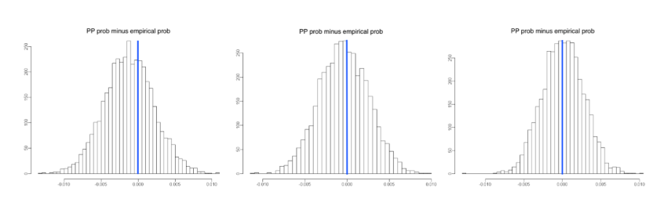

## What is Stan?
> Stan is freedom-respecting open-source software for facilitating statistical inference at the frontiers of applied statistics.

<div style="text-align: right"> -- Stan homepage </div>

## Software for Bayesian inference
- Write-your-own sampler
- Purpose built routines for individual models  
    + MCMCPack or bayesm in R
    + Stata's Bayesian package 
    + Sawtooth CBC/HB 
- Tools that automatically build samplers for a wide class of models  
    + WinBugs  
    + JAGS  
    + **Stan**  

# Fitting a hierarchical Bayes choice model with Stan

## Defining a model in Stan
- When you fit a model in Stan, you have to define the model using Stan's syntax. 
- We don't have time to teach you the syntax, but we'll give you a quick peek at what a hierarchical Bayes multinomail logit model looks like. 
- The is model is very similar to that estimated in Sawtooth CBC/HB and bayesm()

## Declare `data`
```{stan, eval=FALSE, echo=TRUE, output.var="dummy"}
data {
  int<lower=2> C; // # of alternatives (choices) in each scenario
  int<lower=1> K; // # of covariates of alternatives
  int<lower=1> R; // # of respondents
  int<lower=1> S; // # of scenarios per respondent
  int<lower=0> G; // # of respondent covariates 
  int<lower=1,upper=C> Y[R, S]; // observed choices
  matrix[C, K] X[R, S]; // matrix of attributes for each obs
  matrix[G, R] Z; // vector of covariates for each respondent
}
```

## Declare `parameters`
```{stan, eval=FALSE, echo=TRUE, output.var="dummy"}
parameters {
  matrix[K, R] Beta;
  matrix[K, G] Theta;
  corr_matrix[K] Omega;
  vector<lower=0>[K] tau;
}
```

## Declare `transformed parameters`
```{stan, eval=FALSE, echo=TRUE, output.var="dummy"}
transformed parameters {
  cov_matrix[K] Sigma = quad_form_diag(Omega, tau);
}
```

## Declare `model`
```{stan, eval=FALSE, echo=TRUE, output.var="dummy"}
model {
  //priors
  to_vector(Theta) ~ normal(0, 10);
  tau ~ cauchy(0, 2.5); 
  Omega ~ lkj_corr(2);
  //likelihood
  for (r in 1:R) {
    Beta[,r] ~ multi_normal(Theta*Z[,r], Sigma);	
    for (s in 1:S)
      Y[r,s] ~ categorical_logit(X[r,s]*Beta[,r]);
  }
}
```

## Choice-based conjoint data for chocolate bars
- Fourteen respondents each answered 25 choice tasks where they selected from among three chocolate bars. 
- Three attributes
    + Brand: Hersheys, Dove, Lindt, Godiva, Ghirardelli
    + Type: Milk, Milk with nuts, Dark, Dark with nuts, White

```{r, echo=FALSE, eval=TRUE}
rm(list=ls()) # tidy up
choc.df <- read.csv("cbc_chocolate.csv")
choc.contrasts <- list(Brand = "contr.sum", Type = "contr.sum")
choc.coded <- model.matrix(~ Brand + Type, data = choc.df, 
                           contrasts = choc.contrasts)
choc.coded <- choc.coded[,2:ncol(choc.coded)] # remove intercept
# Fix the bad labels from contr.sum
choc.names <- c("BrandDove", "BrandGhirardelli", "BrandGodiva", 
                "BrandHersheys", "TypeDark", "TypeDarkNuts", 
                "TypeMilk", "TypeMilkNuts")
colnames(choc.coded) <- choc.names
choc.df <- cbind(choc.df, choc.coded)
R <- length(unique(choc.df$Ind))
S <- length(unique(choc.df$Trial))
C <- max(choc.df$Alt)
K <- 9
Y <- array(dim=c(R, S))
X <- array(rnorm(R*S*C*K), dim=c(R, S, C, K)) 
Z <- array(1, dim=c(1, R)) # intercept only
for (r in 1:R) { # respondents
  for (s in 1:S){ # choice scenarios
    scenario <- choc.df[choc.df$Ind==unique(choc.df$Ind)[r] & 
                        choc.df$Trial==unique(choc.df$Trial)[s], ]
    X[r,s,,] <- data.matrix(scenario[,c(7, 9:16)]) 
    Y[r,s] <- scenario$Alt[as.logical(scenario$Chosen)]
  }
}
choc.standata <- list(C=C, K=K, R=R, S=S, G=1, Y=Y, X=X, Z=Z)
rm(Y, X, Z, R, S, r, s, C, K, choc.contrasts, scenario, choc.coded)
```

## Chocolate data in R
Data is formatted as a list with elements the same as those declared in the `data` block in the Stan model.
```{R}
str(choc.standata)
```

## Bayesian inference


## Call the `stan()` function
```{R}
library(rstan)
choc.stan <- stan(file="hmnl.stan", data=choc.standata)
```

## Parameter estimates (1)
```{r, message=FALSE}
plot(choc.stan, pars=c("Theta", "tau"))
```

## Parameter estimates (2)
```{r, message=FALSE}
plot(choc.stan, pars=paste("Beta[", 1:9, ",1]", sep="")) + 
  ggtitle("Respondent 1: Likes Milk Chocolate")
```

## Parameter estimates (3)
```{r, message=FALSE}
plot(choc.stan, pars=paste("Beta[", 1:9, ",2]", sep="")) + 
  ggtitle("Respondent 2: Likes Dark Chocolate")
```

## Simulating shares
- You can write a simulator in R to simulate shares. 
- If you want a user interface for the simulator, try Shiny.

# Fitting other models in Stan

## Fitting other models in Stan
- The real power of Stan is that you can change the model to whatever you want. 
- We have used Stan to fit: 
    + Alternative priors (conjugacy isn't required!)
    + Hierarchcal nested logit model for dual choice
    + Dynamic linear models
    + Missing data models 
    
## Problem: Shares in dual choice model
Predicted shares for no-choice option are much less than predicted.  


## HB nested logit Stan model
```{stan, eval=FALSE, echo=TRUE, output.var="dummy"}
model {
  lambda ~ uniform(0, 1);
  sigma_raw ~ normal(0, 1);
  to_vector(Theta_raw) ~ normal(0, 1);
  to_vector(Epsilon) ~ normal(0, 1);
  for (r in 1:R) {
    vector[K] b = Beta[2:(K+1), r];
    real alpha = Beta[1,r];
    for (s in 1:S) {
      vector[C] u = X[r,s] * b;
    	real u_buy = alpha + lambda * log_sum_exp(u);
    	Y1[r,s] ~ categorical_logit(u);
      Y2[r,s] ~ bernoulli_logit(u_buy);
    }
  }
}
```

## Problem solved
The nested logit model produces good predictions for the no-choice option in holdout tasks.



And building this model in Stan took hours, not days or weeks.

# A few more things you should know about Stan

## Who is responsible for Stan? 
- Stan is maintained by the [Stan development team](http://mc-stan.org/about/team/index.html), which consistes of consists of volunteers from around the world. 
- Key players include Andrew Gelman, Bob Carpenter, Michael Betancourt, but they have been joined by many others. 

## There are many ways to interface with Stan 
- **RStan (R)**
- PyStan (Python)
- CmdStan (shell, command-line terminal)
- MatlabStan (MATLAB)
- Stan.jl (Julia)
- StataStan (Stata)
- MathematicaStan (Mathematica)

## Stan supports multiple approches to inference
- Hamiltonian Monte Carlo / NUTS 
    + Robust algorithm for Bayesian inference
- Variational Bayes
    + A fast approximation to full Bayesian inference
    + Somewhat experimental in Stan
- "Optimization"
    + Routines that find point estimates of parameters rather than the full posterior, e.g. maximum likelihood (ML) or maximum a posteriori (MAP)
    

## Why Stan? 
- Ideal tool for rapid prototyping of new models
- Robust and fast sampler
- Modern, thoughful software design
- Increasingly attractive option for fitting even standard Bayesian models
    
# Thank you!
Thanks to The Modellers for sharing the code for the hierarchical nested logit model. Thanks to Adobe for their support.